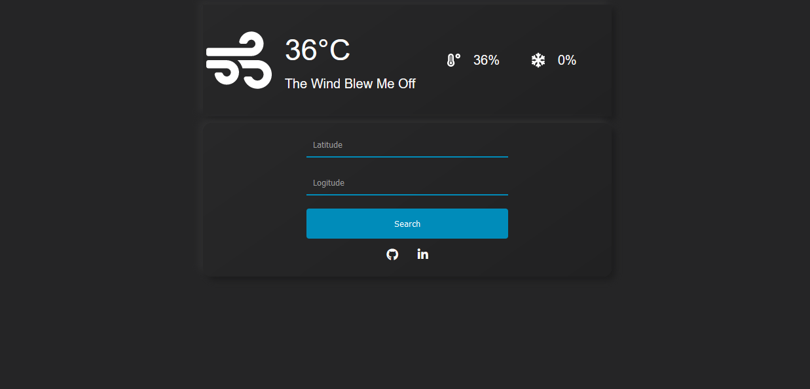
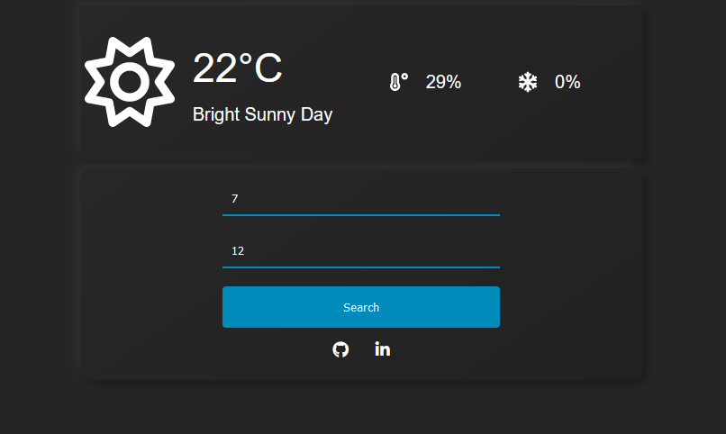

# Weather App

A straightforward weather app providing real-time updates.

## Tech


## Installation
Navigate to the parent directory and execute the following commands.

```bash
  npm install 
  npx vite
```
    
## UI Screenshots

 </img>

 </img>

